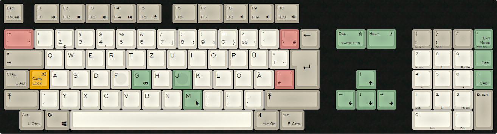

# a500kbd-usbhid-stm32

*warning: still needs a big cleanup and better documentation*

## About ##

This is a firmware for a cheap STM32F103xxx microcontroller that allows you to use an original Commodore Amiga keyboard as USB HID device. The HAL middleware has been created with STM32CubeMX, protocol has been implemented according original Amiga Hardware Reference Manual which describes the handshake pretty straight forward.

## Features ##

Here's a picture of the custom layout of a german A500 keyboard:

(It should work with any Amiga keyboard layout, implementation is independent of the actual international version)

### Mouse mode ###

You can enter USB mouse mode by pressing Help-m. Now the *Del* and *Help* key become left and right mouse buttons, the cursor keys allow you to steer the mouse pointer.
- *Keypad Minus* will decrease pointer speed
- *Keypad Plus* will increase pointer speed
- *Keypad Multiply* will leave mouse mode

### Extended Function Keys ###

By pressing and holding Help-_function key_ you will have function keys F11 to F20. Alternate function can be toggled with Help-Del, then you will have the media keys as displayed in the image:
  - F1 : rewind
  - F2 : stop
  - F3 : pause/play
  - F4 : forward
  - F5 : eject
  - F8 : mute volume
  - F9 : decrease volume
  - F10 : increase volume

(I will trigger a GPIO pin so you can have a custom LED indicator for the mode)

### Swap Alt and Ctrl ###

Since I don't like CAPS-LOCK I'm using it for something completely different: swapping alt and ctrl.
If CAPS-LOCK is turned on, the following keys will be remapped to match a modern keyboard:
- Left Ctrl becomes Left Alt
- Left Alt becomes Left Control
- Right Amiga becomes Alt Gr
- Right Alt becomes Right Control
Turning CAPS-LOCK off switches back to the original labelling.

### Joystick/Gamepad mode

Help-j will enter sort of a gamepad mode. This was just a test, currently 16 buttons are mapped (keys a,b,x,y,shifts,ctrls,alts,enter,space,escape,del,help,..) and cursor keys as analog stick. Still trying here. Basic idea is to expose two joysticks at once, so two players could play later on a single keyboard with wasd and cursor keys as two true USB gamepads. Not sure if this makes sense after all, will see later.

### Miscellaneous ###
- you can soft reset the keyboard by sending ctrl-amiga-amiga. CAPS-LOCK will flash shortly.
- USB vid/pid are pure fantasy (6666:6666)
- if you wire the UART serial pins to your computer you're getting debug messages from the keyboard

## How to build and assemble ##

- Get your favorite STM32 microcontroller. I'm using a very cheap STM32F103C6T8 development board for less than $2
- connect DATA, CLOCK, RESET, 5V and GND with the microcontroller. 
- everything is done in main.c and survives a re-generation using the STM32CubeMX code generator, but there are two modifications in the code that will be overwritten:
1) usbd_hid.c:USBD_HID_SendReport() has been changed to actually return the success state
2) HID_CUSTOM_ReportDesc has been changed to mouse+keyboard descriptor

There's a plain Makefile which needs nothing more than the arm-none-eabi toolchain. Just install it and "make" it. You need to flash it afterwards to your microcontroller; you can do that with simple serial wiring, ST link or any other (professional) solution. Search the internet for it, I'm not explaining it here.

## Ideas ##

### support the Amiga keyboard LEDs through HID output report
my STM32 is not strong enough to drive the LEDs and would require some extra circuitry. Or, I'm adding a few more modern LEDs and colors

### embedded virtual serial port
this would allow an always available serial console for the keyboard and no extra cables. User would just open the new COM port and could see debug messages and configure it, ie a text console with configuration commands

### add a motion processing unit
they're also cheap and suddenly the keyboard has accelleration, magnetoscope, gyroscope, ... and you could swing it like a sword game controller...

### cat lock, not caps lock.
I don't have a cat, but some magic keystroke should allow you to completely ignore all input - except the magic unlock keystroke. Or even as a child/baby protection: slurp all keys that would do something bad like reset, windows key, alt-tab, etc - then your kid could type whatever it wants but no accidental exits any more

### configuration file system
Register as usb storage device and expose a CONFIG.TXT file, which you can edit to change the keyboard configuration at runtime. Maybe Help-u to insert/eject the storage device. Then the virtual serial port would not be needed...

### LCD/OLED display
Instead of LEDs a cheap OLED display could be used to display state of keyboard (num/scr/caps/mode locks).  

Have fun with it!
